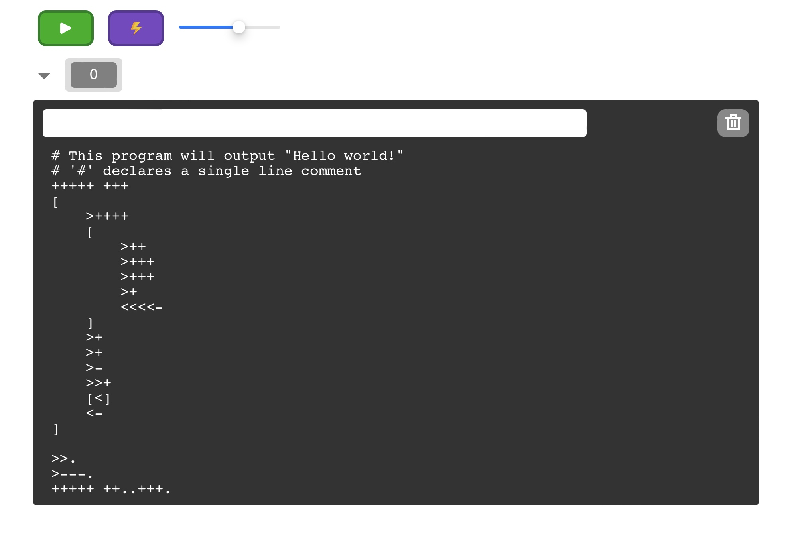

# visual-brainfuck-web

A Brainf\*ck interpreter online. Visit [visual-brainfuck-web Github Page](https://zhangzheheng12345.github.io/visual-brainfuck-web) to have a try.

If you don't have any idea about what Brainf\*ck exactly is, visit [Brainf\*ck Wiki](https://esolangs.org/wiki/brainfuck).

## Usage

### To run & stop

The green triangle button runs the Brainf\*ck code in the large text area. The grey square button immediately stops the running program.

### Minify your code

Click the purple button with a lightning in the middle. It will remove comments, spaces, tabs and line breaks in your code.

### View program data

The grey triangle button shows or hides the data area. The data area will show you how the program changes the pointer's position and changes the data in an obvious way.
( The darker and bigger block is where the pointer located. )

If the data area is hidden, the program will be run without updating the data area, which means it will run faster. The data area will be updated when the program finishes.

The data area won't limit the number of the cells.

### Speed

The slider can change the speed when the data area is shown.
Drag it to the right if you want the program to run faster.

### IO

The input widget (white) enables you to type your inputs ( `,` command in Brainf\*ck will get the input from here, but you should get the inputs ready before press the **Run** button), and see the outputs ( `.` command in Brainf\*ck will output to here).

### More

The trash bin button enables you to clear the Brainf\*ck code in the text area in a quicker way. Besides, it will remove the cookie which memorizes your code. Click it, and all the long weird codes will disappear at once. 

`#` declares a comment which continues to the end of the line. This feature is not included in standard brainfuck.

## Your support is needed ⭐️

Be free to put forward issues. The website has only been tested on Safari and Chrome, and there might be problems while running in Microsoft Edge.

Anyway, send email to me ( visit my Github profile to find my email ) or put an issue in Github if you meet any sort of mistake. If you are quite interested in this project and want to have a further contribution, fork & start YOUR Pull Request!

In the future, code minifying, step-by-step debugging may be supported.

## License and thanks

This project is GPL 2.0 licensed and it used to be MIT licensed.

Thanks for [Iconduck](https://iconduck.com) providing such excellent icons. The run icon, stop icon, speed showing screen icon, and the trash bin icon are all downloaded from Iconduck. They're all MIT licensed.
